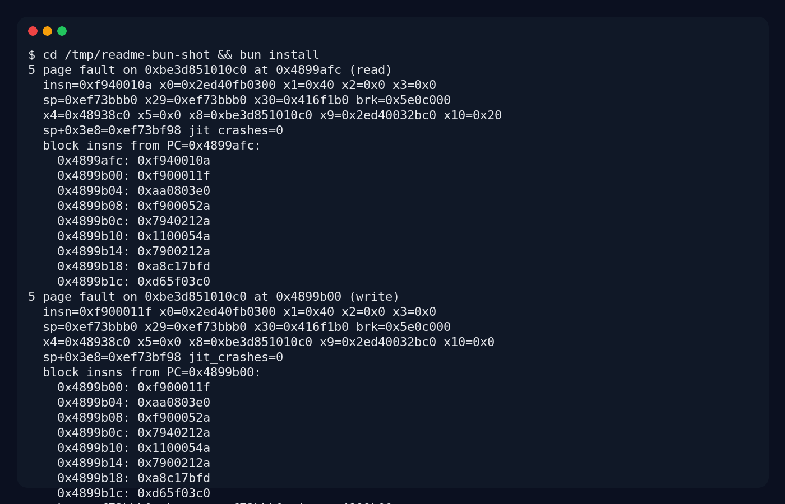

# iSH ARM64 bring-up fork

This repository is an ARM64 bring-up fork of [iSH](https://ish.app/) focused on making an AArch64 Linux guest practical enough to run modern language runtimes and build tools on ARM64 hosts.

The upstream/original README has been preserved as [ORIGINAL_README.md](ORIGINAL_README.md). The deeper ARM64 technical notes are in [README_arm64.md](README_arm64.md).

## What we have been doing

We have been progressively hardening the ARM64 guest backend and replacing ad-hoc smoke tests with repeatable coverage. The current work is centered on the Linux-host harness in this repo, using the Alpine ARM64 fakefs root and the threaded-code Asbestos ARM64 backend.

### Build and harness work

- Added a top-level `Makefile` that captures the local Linux bring-up flow:
  - `make build-arm64-linux`
  - `make build-arm64-linux-debug`
  - `make build-arm64-linux-all`
  - `make test-arm64-runtime-coverage`
  - `make test-arm64-runtime-coverage-debug`
- Added `tests/arm64/runtime-coverage.sh`, a staged coverage gate for:
  - base shell, `apk`, tmp file I/O
  - C compile and execute
  - Go compile/run/build/test
  - Bun install/run/test/build
  - Node/npm version/eval/run
- Added a Linux SDL/VNC terminal harness for interactive guest debugging:
  - `tools/ish_sdl_vnc.c`
  - `tools/run-sdl-vnc.sh`
- Documented Linux-host ABI details in [docs/LINUX_BUILD_AND_HOST_ABI.md](docs/LINUX_BUILD_AND_HOST_ABI.md).

### Platform separation

Host OS differences are being moved behind `platform/platform.h` with one implementation per host under `platform/`:

- `platform/linux.c`
- `platform/darwin.c` for macOS/iOS-family hosts

The first tranche centralizes FD-path lookup, stat timestamp fields, host random bytes, and thread naming so core emulator/kernel code no longer needs direct `__linux__`/`__APPLE__` branches for those details.

### Emulator/runtime fixes so far

- Fixed stale threaded-code/TLB invalidation paths around mapping and exec transitions.
- Added ARM64 syscall coverage and quiet fallback stubs for modern runtime probes such as `rseq` and `io_uring_*`.
- Implemented ARM64 `preadv`/`pwritev` syscall wiring, removing noisy Node/npm fallback stubs.
- Fixed lazy `MAP_NORESERVE` reservation permissions so later `mprotect()` calls update reservation metadata before demand faults materialize pages.
- Re-enabled valid high ARM64 mmap hints within the 48-bit guest address space, which is required by modern JS runtimes that derive heap/cage pointers from returned mappings.
- Prefer the high 48-bit address space for large anonymous `MAP_NORESERVE` arenas so Bun/JSC/V8 do not exhaust the low 4GB mmap window.
- Fixed pair-exclusive `STXP/STLXP` state handling so the standalone 64-bit and 32-bit LDXP/STLXP atomic repros now pass.
- Added `CASP`/128-bit compare-exchange decode/helper plumbing; the standalone CAS128 repro now passes.
- Added small atomic repro sources under `tests/arm64/atomics/` for LDXP/STLXP and CAS128.
- Stopped advertising optional ARM64 crypto/LSE features in `AT_HWCAP` until those helper sets are fully coverage-clean; runtimes can fall back to baseline FP/ASIMD paths.

## Current coverage status

Latest staged runtime report: **16 / 20 passing**. C, Go, and Node/npm are green; Bun remains the red area.

| Area | Status | Notes |
|---|---:|---|
| Base shell / apk / tmp I/O | Passing | Basic guest execution and filesystem operations are stable. |
| C toolchain | Passing | `gcc` can compile and execute a simple program. |
| Go | Passing | `go version`, `go env`, `go tool compile`, `go run`, `go build`, and `go test` pass. |
| Node/npm | Passing | `node -e`, `npm --version`, and `npm run` pass after mmap/reservation and `pwritev` fixes. |
| Bun | Failing | Bun starts and reports its version, but install/run/test/build still hit allocator/runtime faults. |

## Bun install failure snapshot

The remaining red path is Bun. This screenshot shows the current failure mode when trying to install a local `file:` dependency inside the guest:



The most common current signatures are faults in Bun/JSC allocation paths around `0x4899afc`, `0x4899b00`, and sometimes `0x489a190`, with corrupted high free-list pointers. CASP/128-bit atomic coverage is now green and large high arenas are available, so the next debugging target is the remaining Bun allocator/TLS/threading behavior and optional crypto/LSE helper coverage.

## Quick start

```bash
make build-arm64-linux-all
make test-arm64-runtime-coverage REPORT_DIR=/workspace/tmp TIMEOUT_S=90 INSTALL_TIMEOUT_S=900
```

The coverage suite is intentionally still red while Bun is being brought up. Treat failures as emulator/runtime bugs to fix, not cases to skip.
